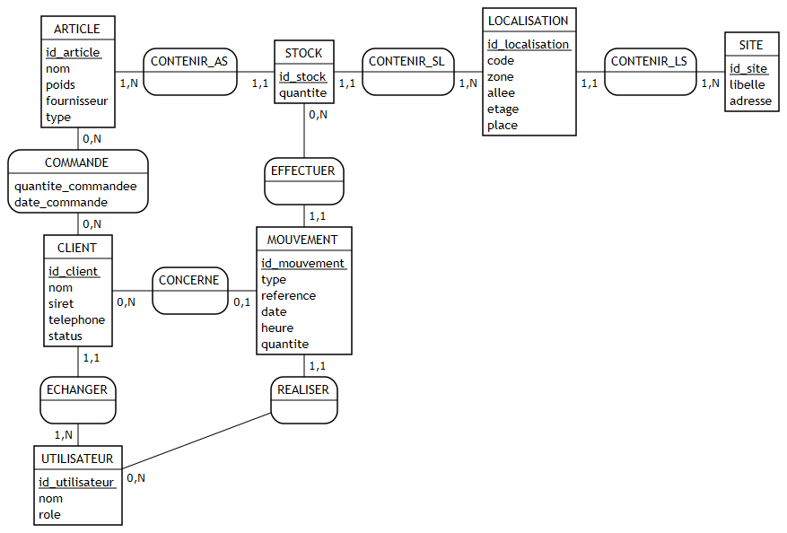

# MCD WMS — V2

> Remplace la V1 du 2026-05-22. **5 corrections** appliquées suite à arbitrage métier (NTL = grossiste) et revue critique. Source de vérité graphique : [`wms-mcd.png`](wms-mcd.png), source Mocodo : [`wms-mcd.mcd`](wms-mcd.mcd).

## 1. Postulat métier

NTL est un **grossiste** : achète à des fournisseurs, stocke pour son propre compte sur 4 sites, revend à des clients. Tous les biens stockés sont propriété NTL. Voir [`decisions/0003-postulats-cadrage-ntl.md`](../../decisions/0003-postulats-cadrage-ntl.md) (à venir).

## 2. Diagramme



## 3. Entités (7)

| # | Entité | Identifiant | Attributs |
|---|---|---|---|
| 1 | `ARTICLE` | `id_article` | `nom`, `poids`, `fournisseur`, `type` |
| 2 | `CLIENT` | `id_client` | `nom`, `siret`, `telephone`, `status` |
| 3 | `STOCK` | `id_stock` | `quantite` |
| 4 | `LOCALISATION` | `id_localisation` | `code`, `zone`, `allee`, `etage`, `place` |
| 5 | `SITE` | `id_site` | `libelle`, `adresse` |
| 6 | `UTILISATEUR` | `id_utilisateur` | `nom`, `role` |
| 7 | `MOUVEMENT` | `id_mouvement` | `type`, `reference`, `date`, `heure`, **`quantite`** ★ |

## 4. Associations (8)

| Association | Entité A | Card. A | Entité B | Card. B |
|---|---|---|---|---|
| `COMMANDE` | CLIENT | (0,N) | ARTICLE | **(0,N)** ★ |
| `CONTENIR_AS` (article-stock) | ARTICLE | (1,N) | STOCK | **(1,1)** ★ |
| `CONTENIR_SL` (stock-loc) | STOCK | (1,1) | LOCALISATION | (1,N) |
| `CONTENIR_LS` (loc-site) | LOCALISATION | (1,1) | SITE | (1,N) |
| `EFFECTUER` | STOCK | **(0,N)** ★ | MOUVEMENT | (1,1) |
| `REALISER` | UTILISATEUR | (0,N) | MOUVEMENT | (1,1) |
| `ECHANGER` | CLIENT | (1,1) | UTILISATEUR | (1,N) |
| **`CONCERNE`** ★ | MOUVEMENT | (0,1) | CLIENT | (0,N) |

Attributs sur associations :
- `COMMANDE` : `quantite_commandee`, `date_commande`

## 5. Les 5 corrections appliquées vs V1

| ★ | Endroit | Avant V1 | Après V2 | Justification |
|---|---|---|---|---|
| 1 | `EFFECTUER` côté STOCK | (0,1) | **(0,N)** | Une ligne de stock subit plusieurs mouvements dans sa vie (entrée + sortie + ajustement + transfert). Le (0,1) précédent interdisait toute traçabilité après le 1er événement. |
| 2 | `CONTENIR_AS` côté STOCK | (0,N) | **(1,1)** | Un stock = 1 article × 1 emplacement × 1 quantité. Modèle propre : "il y a N unités de l'article A à l'emplacement E". Évite la quantité ambiguë sur stock multi-articles. |
| 3 | Nouvelle association `CONCERNE` MOUVEMENT-CLIENT | — | `MOUVEMENT (0,1) — (0,N) CLIENT` | Permet de répondre à *"qu'a-t-on expédié à tel client ?"*. (0,1) côté MOUVEMENT car les transferts internes n'ont pas de client. |
| 4 | `COMMANDE` côté ARTICLE | (1,N) | **(0,N)** | Un article peut être référencé au catalogue avant d'avoir été commandé par un client. |
| 5 | Attribut `quantite` sur MOUVEMENT | absent | présent (`INT > 0`) | Permet de reconstituer un solde par cumul. La valeur est positive ; le sens (entrée/sortie) est porté par l'attribut `type`. |

## 6. Règles de gestion appliquées

- **RG1** : Un article référencé au catalogue peut exister sans stock physique ni commande (cas neuf produit).
- **RG2** : Un stock = exactement 1 article × 1 emplacement × 1 quantité (option A trancée le 2026-05-22).
- **RG3** : Un mouvement concerne **exactement 1** stock et **0 ou 1** client (transferts internes = sans client).
- **RG4** : Chaque client est géré par exactement 1 utilisateur (gestionnaire de compte unique).
- **RG5** : Tout mouvement est tracé par exactement 1 utilisateur (responsabilité opérationnelle).
- **RG6** : La quantité d'un mouvement est **toujours strictement positive** ; le sens (entrée/sortie/ajustement/transfert) est porté par `MOUVEMENT.type`.

## 7. Hors périmètre V1 (à assumer en soutenance)

- **Achats** : la gestion des fournisseurs n'est pas modélisée (attribut texte `ARTICLE.fournisseur` uniquement).
- **Commande transactionnelle complète** : la table `COMMANDE` ne porte que `quantite_commandee` et `date_commande` ; pas de prix, statut livraison, multi-lignes. La gestion complète des commandes est portée par l'ERP commercial NTL.
- **Lots / numéros de série / dates de péremption** : modèle V1 considère tous les articles d'un type interchangeables.
- **Transport / expédition** : aucune modélisation transporteur ou tournée.
- **Multi-tenant client** : NTL grossiste = stock propre = pas d'isolation tenant logique. Si pivot 3PL futur → réintroduire FK `(article, client)`.

## 8. Génération du diagramme

```bash
cd 01-architecture-technique/mcd
python -m mocodo --input wms-mcd.mcd --output_dir . --svg_to png --detect_overlaps
```

Génère : `wms-mcd.svg`, `wms-mcd.png`, `wms-mcd_geo.json`.
